# Welcome to Dublin Taekwondo Academy 

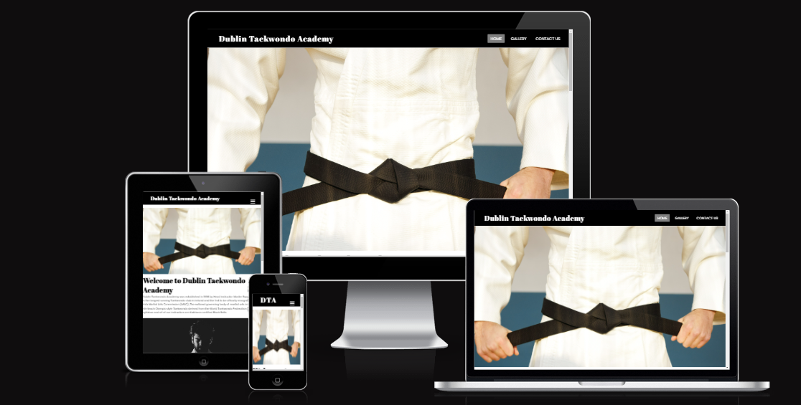

# UX
### Site Goals
The goal of Dublin Taekwondo is to provide people of all ages a premium martial arts facility where they can learn martial arts and get fit at the same time.
We also want to provide all of our academy's information, training schedule and give our current and potential students a clear view of our vision. The website should be easy to navigate and all of the above information will be at any visitors fingertips.

## User Stories
### As a visitor:
- I want to be able to view a description/history of the Academy
- I want to learn about the Instructor(s) in charge
- I want to be able to easily and quickly navigate to different areas of the site
- I want to be able to view class schedule and training times
- I want to easily find the Academy location
- I want to know what age groups are catered for
- I want to see pictures or videos of the Academy
- I want to be able to easily contact the Academy
- I want to be able to find the social media links of the Academy

### As the creator:
- I want to be able to add additional information about the instructors
- I want to be able to add recent images to the gallery
- I want to add upcoming tournament/event information
- I want to make the website appealing to all potential new students

## Wireframes
- I used Balsamiq wireframes to briefly map out how I wanted the website to look 
I will attach my wireframes below before my features to show how I implemented the plan
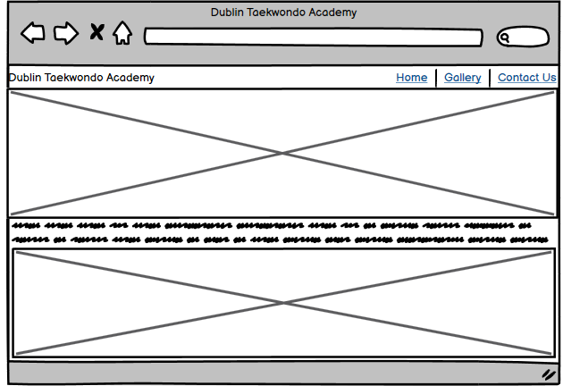
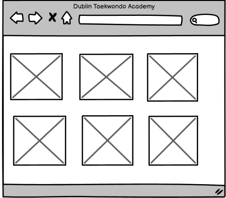
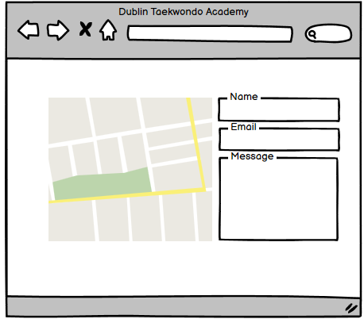

## Features
In this section I would like to highlight all of the features I have currently implemented on the website
### Exsisting Features
- I created a fully responsive navigation bar which clearly shows the user the links to our home page, 
gallery & contact us sections. I also made the navigation bar identical on every page to keep navigation
easy and intuitive for the user
- I implemented this section so the user has a more streamlined experience and won't require the use of a back button

- The Home page consists of a main landing image that is color co-ordinated with the style of the website and introduces 
the user to the website and explains who we are, our mission and what we offer.

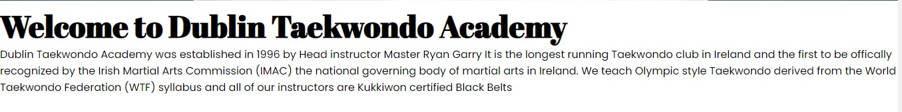
- This format is repeated where we detail the benefits of our Academy, the classes and services we offer and of Taekwondo in general
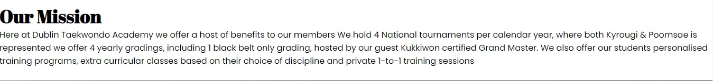
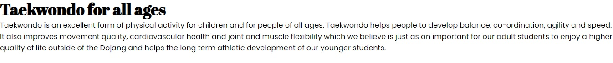

- The second page of the website we have our Gallery page. The gallery was implemented with flexbox and is fully responsive across all device sizes
- I have included 6 images which I think best detail what we offer here at Dublin Taekwondo Academy 
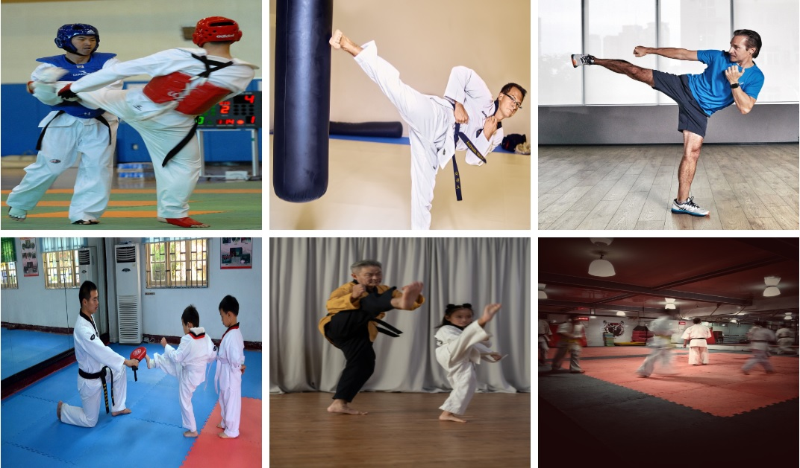

- The third page consists of a Contact Form where users can enter their details and enquire about specific classes and services that are on offer at Dublin Taekwondo Academy 
- The Contact Us page also consists of a fully responsive Google Map implemented using an iframe
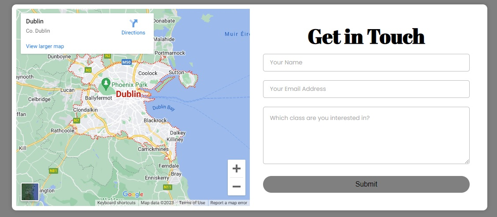

- Lastly I have included a fully responsive footer across all pages of the website including the 404 page
- The footer includes links to our social media channels and an easy navigation bar back to any of our other pages on the website 

# Testing
## Validator Testing
- I have used the Jigsaw CSS validator website by sumbitting my CSS file by Direct Input and the Validator found no errors
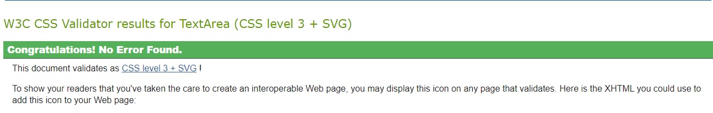

- I have used W3C Validator for all 4 html files and all 4 pages have passed with no errors a seen below
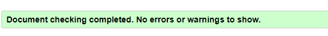
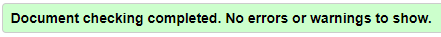
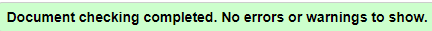
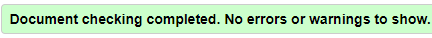

## Google Lighthouse
- I used Google Chrome Developer tools Lighthouse to validate the Accessibility of my website and it also passed please see below 
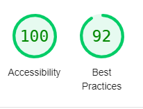
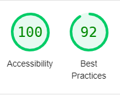
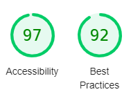

## Fixed Bugs
- Contact form was intruding on the footer of the contact page when screen size was lowered but I ammended this by creating a media query decreasing the size of the form
- The Navigation bar logo was too big when the screen size was lowered, I corrected this by creating a second smaller logo and setting display to none on bigger screen sizes and making a media query where it was visible

## Feature Testing Navbar
- Feature: Navbar Logo

- Expect: Returns to Home when clicked

- Action: Clicked the Logo on navbar

- Result: Successfully returned to Home Page

- Feature: Home Button

- Expect: Returns to Home when clicked

- Action: Clicked the Home Button on navbar

- Result: Successfully returned to Home Page

- Feature: Gallery Button

- Expect: Opens Gallery when clicked

- Action: Clicked Gallery Button on navbar

- Result: Successfully opens Gallery

- Feature: Contact Us Button

- Expect: Opens Contact Form when clicked

- Action: Clicked the contact us button

- Result: Successfully opened the contact us page

## Testing of User Stories
- Expectations: As a Visitor I want to find all of the information about the Dublin Taekwondo Academy including location, information about instructors, what I will achieve by signing up and how I can contact the Academy.

- Result: As a Visitor I have found the location of the academy along with all of the information in regards to classes, instructors and benefits of becoming a member

- Expectation: As a visitor I want to be able to easily navigate around the website and contact the academy

- Result: I was able to navigate easily through the website and easily found and submitted a contact form

# Deployment
## The site was deployed to Github Pages, the steps are as follows:
- In the Repository, click the settings tab
- Select Master branch from the source section drop-down menu
- Once you have selected Master branch, the page will automatically refresh and display that the site has been successfully deployed
**Find the live link here** - [Dublin Taekwondo Academy](https://ryangarry1.github.io/Dublin-Taekwondo-Academy/)

